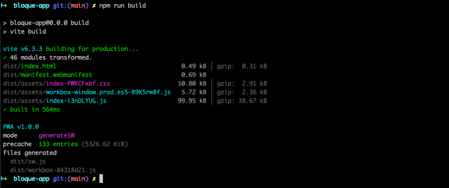
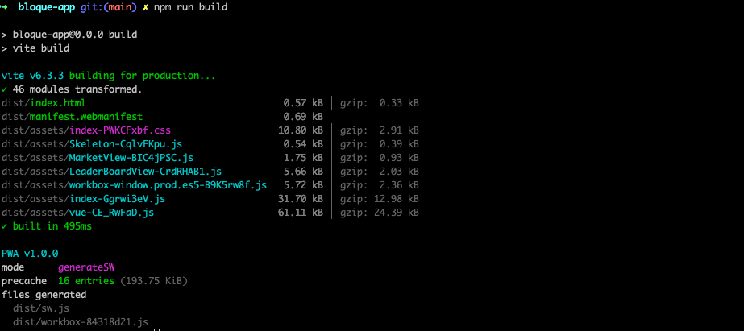
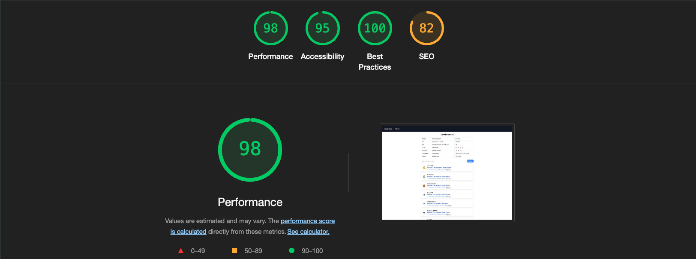
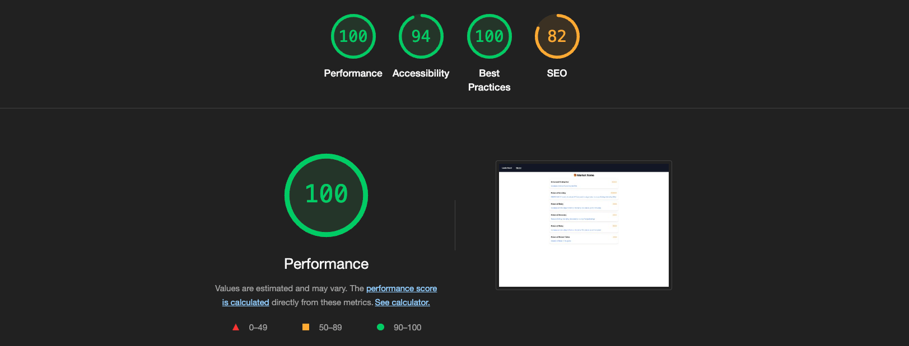
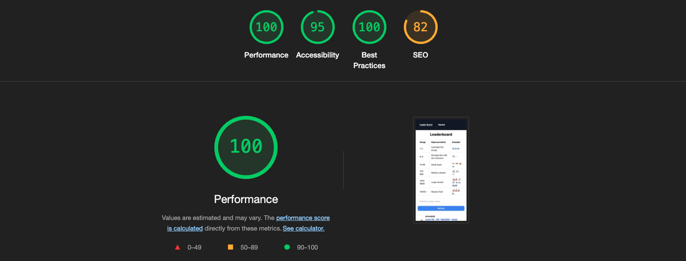
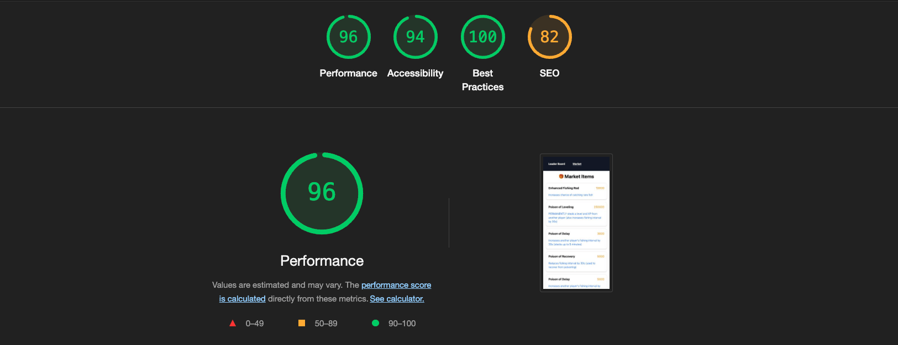

# bloque-app

This template should help get you started developing with Vue 3 in Vite.

## Demo (https://bloque-app.vercel.app/)

## 🚀 Performance Optimization

### ✅ Image Compression

All images used in the project have been compressed to reduce load time and improve overall performance.

### 📦 Bundle Size Comparison

#### Reducing your index bundle size from 99.95 kB → 31.70 kB (gzip: 38.67 kB → 12.98 kB) offers a 68% reduction in bundle size and fast initial loading time.

**Before Optimization:**



**After Optimization:**



### 💡 Lighthouse Score

> 📈 **Note:** The Lighthouse performance score is consistently over **95**, indicating excellent load time, accessibility, and best practices.

>  >  >  > 

## Recommended IDE Setup

[VSCode](https://code.visualstudio.com/) + [Volar](https://marketplace.visualstudio.com/items?itemName=Vue.volar) (and disable Vetur).

## Customize configuration

See [Vite Configuration Reference](https://vite.dev/config/).

## Project Setup

```sh
npm install
```

### Compile and Hot-Reload for Development

```sh
npm run dev
```

### Compile and Minify for Production

```sh
npm run build
```

### Lint with [ESLint](https://eslint.org/)

```sh
npm run lint
```
